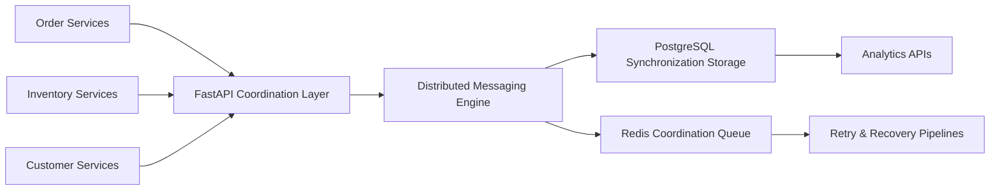
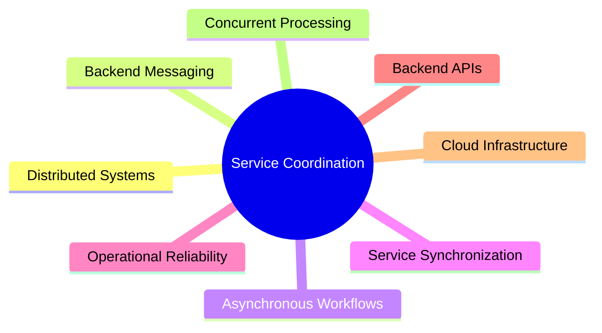

<div align="center">

# SERVICE COORDINATION MESSAGING PLATFORM

### Distributed Backend Coordination • Asynchronous Messaging • Service Synchronization Infrastructure


<br>


</div>

---

# Overview

The Service Coordination Messaging Platform is a scalable distributed backend coordination system engineered to support asynchronous communication, synchronization, and workflow orchestration across multiple backend services and operational domains.

The platform focuses on:

- Distributed backend coordination
- Asynchronous messaging workflows
- Inventory synchronization
- Order processing orchestration
- Backend communication pipelines
- Service reliability engineering
- Distributed operational consistency
- High-throughput service interaction

The architecture is optimized for scalable backend ecosystems where multiple operational services must coordinate efficiently while maintaining synchronization reliability and throughput performance.

---

# Engineering Objectives

```yaml
Core Objectives:
  - Distributed Service Coordination
  - Asynchronous Messaging
  - Backend Synchronization
  - Scalable Service Communication
  - Workflow Orchestration
  - Operational Consistency
  - Distributed Backend Reliability
````

---

# Platform Workflow



---

# Key Engineering Capabilities

| Capability                 | Description                            |
| -------------------------- | -------------------------------------- |
| Service Coordination       | Distributed backend communication      |
| Messaging Workflows        | Asynchronous synchronization pipelines |
| Operational Reliability    | Retry and recovery engineering         |
| Backend APIs               | Scalable coordination endpoints        |
| Distributed Processing     | Concurrent backend execution           |
| Infrastructure Scalability | Containerized cloud deployment         |

---

# Core Features

## Distributed Service Coordination

* Backend workflow synchronization
* Service orchestration pipelines
* Distributed communication workflows
* Operational coordination logic
* Multi-service interaction handling

---

## Asynchronous Messaging Infrastructure

* Inventory synchronization
* Order-processing coordination
* Customer workflow messaging
* Backend event coordination
* Incremental synchronization pipelines

---

## Reliability Engineering

* Retry recovery workflows
* Synchronization consistency validation
* Failure monitoring
* Backend observability
* Operational resilience handling

---

## Distributed Backend Processing

* Concurrent coordination workflows
* Multi-service execution handling
* Backend throughput optimization
* SQL synchronization workflows
* Operational processing analytics

---

# Technology Stack

## Backend Engineering

* Python
* FastAPI
* REST APIs

---

## Databases & Messaging

* PostgreSQL
* Redis

---

## Infrastructure & Deployment

* Docker
* Linux
* Git
* Cloud-Native Deployment

---

# Project Structure

```bash id="3a7r0f"
├── runtime.py
├── cluster_storage.py
├── service_models.py
├── contracts.py
├── message_broker.py
├── connectors.py
├── distributed_worker.py
├── throughput_monitor.py
├── database_initializer.py
├── sample_workload.py
├── Dockerfile
├── docker-compose.yml
├── requirements.txt
└── README.md
```

---

# API Endpoints

| Method | Endpoint                | Description                     |
| ------ | ----------------------- | ------------------------------- |
| POST   | /orders                 | Order coordination              |
| POST   | /inventory/update       | Inventory synchronization       |
| POST   | /customers/register     | Customer registration workflows |
| GET    | /synchronization/status | Backend synchronization status  |
| GET    | /health                 | Platform health check           |

---

# Distributed Coordination Architecture

```yaml id="j6w3rt"
Coordination Stack:
  - FastAPI Backend Services
  - PostgreSQL Synchronization Storage
  - Redis Messaging Infrastructure
  - Distributed Worker Pipelines
  - Dockerized Runtime Environment
```

---

# Engineering Focus Areas

The platform architecture emphasizes:

* Distributed backend coordination
* Asynchronous messaging scalability
* Service synchronization reliability
* Backend throughput optimization
* Concurrent processing workflows
* Retry recovery engineering
* Cloud-native infrastructure support

---

# Performance Engineering

| Optimization Area      | Engineering Focus            |
| ---------------------- | ---------------------------- |
| Coordination Workflows | Concurrent backend execution |
| Messaging              | Asynchronous synchronization |
| Reliability            | Retry recovery pipelines     |
| Infrastructure         | Containerized scalability    |
| SQL Workloads          | Synchronization optimization |

---

# Operational Coordination Workflows

The platform supports visibility for:

* Service synchronization status
* Backend messaging workflows
* Inventory coordination
* Order-processing orchestration
* Operational throughput analytics
* Distributed workflow monitoring

---

# Deployment

```bash id="ocdr2s"
docker-compose up --build
```

The platform supports scalable deployment across distributed backend and cloud-native operational environments.

---

# Scalability Considerations

The system architecture supports:

* Distributed backend scaling
* Concurrent service orchestration
* Asynchronous workflow expansion
* Backend throughput optimization
* Distributed coordination pipelines
* Multi-service operational scaling

---

# Future Enhancements

* Kafka-based messaging infrastructure
* Kubernetes orchestration
* Distributed service discovery
* Event-driven backend architecture
* Real-time operational dashboards
* Advanced observability pipelines
* Multi-region synchronization support

---

# Repository Setup

```bash id="hyt7wi"
git clone <repository-url>

cd service-coordination-messaging-platform

docker-compose up --build
```

---

# Engineering Domains



---

# License

This project is intended for engineering demonstration, portfolio, and educational purposes.

---

<div align="center">

### Distributed Coordination • Asynchronous Messaging • Cloud Native Backend Infrastructure

</div>
```
